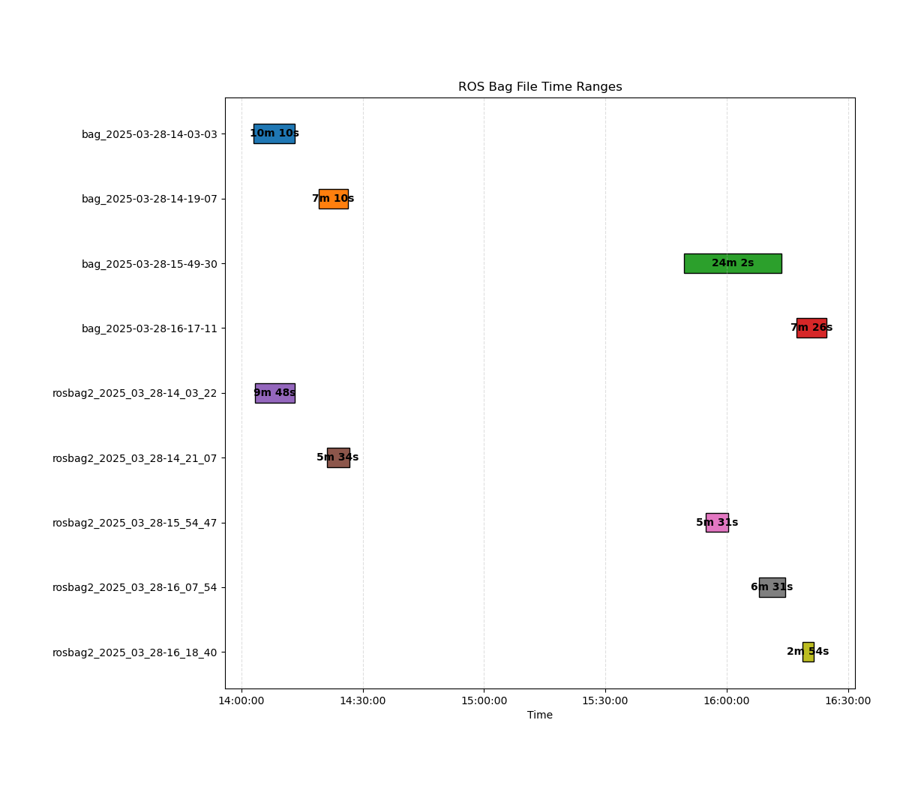

# rosbag_overlap

usage:

```ros2 run rosbag_overlap rosbag_overlap```

```--bags``` the bag files you want to compare/crop

```--plot``` creates a bar plot

```--crop``` if this flag is set, a clipped copy of all bag files will be created

```--output-dir``` the directory for cropped bag files, defaults to _cropped_bags_

